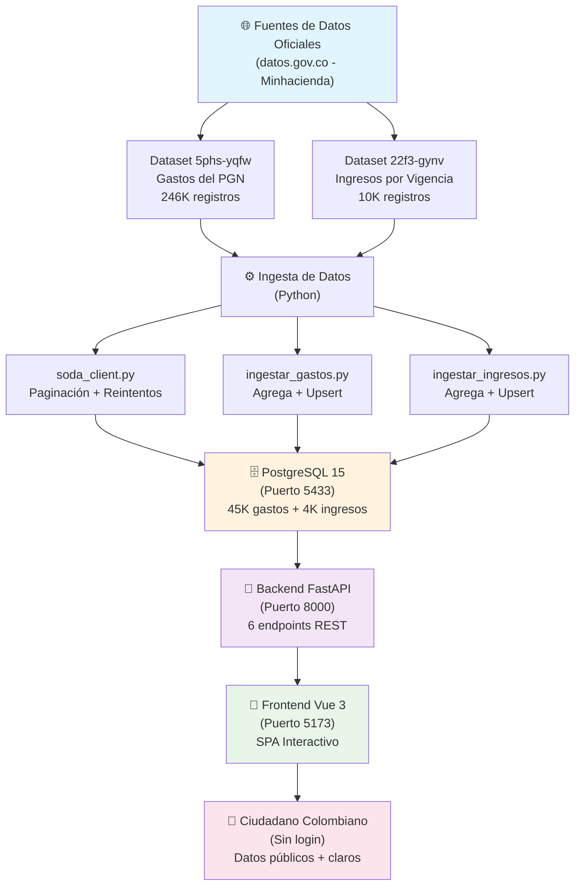
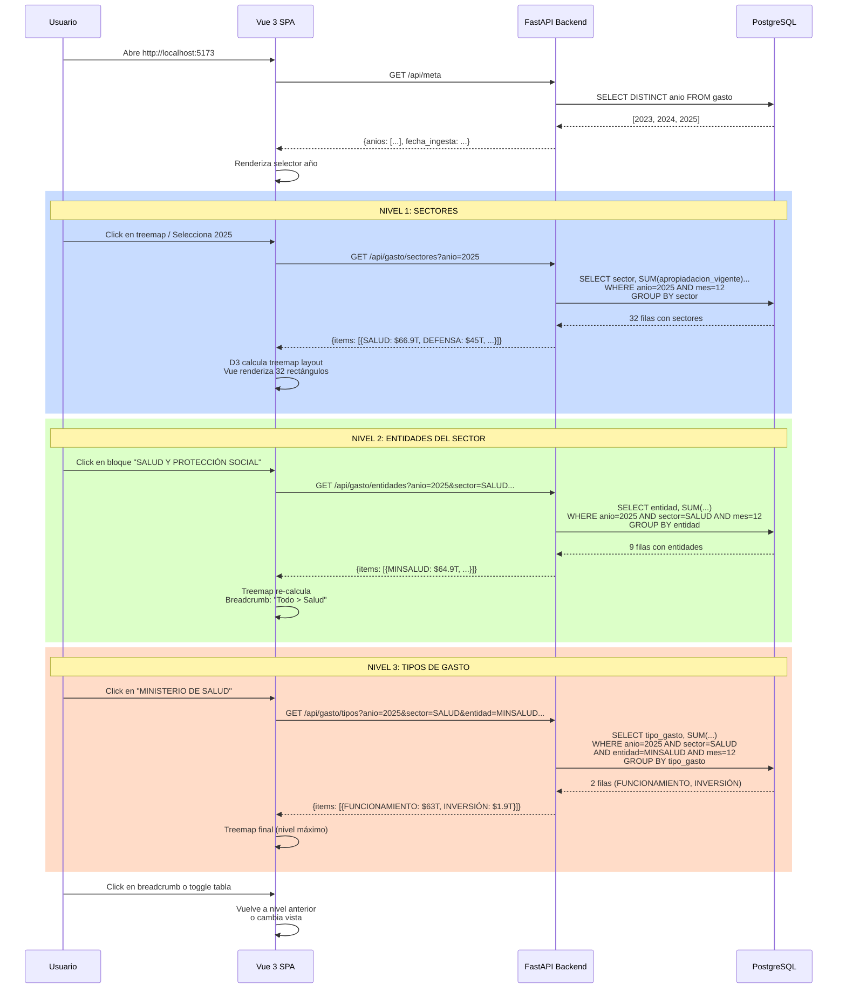
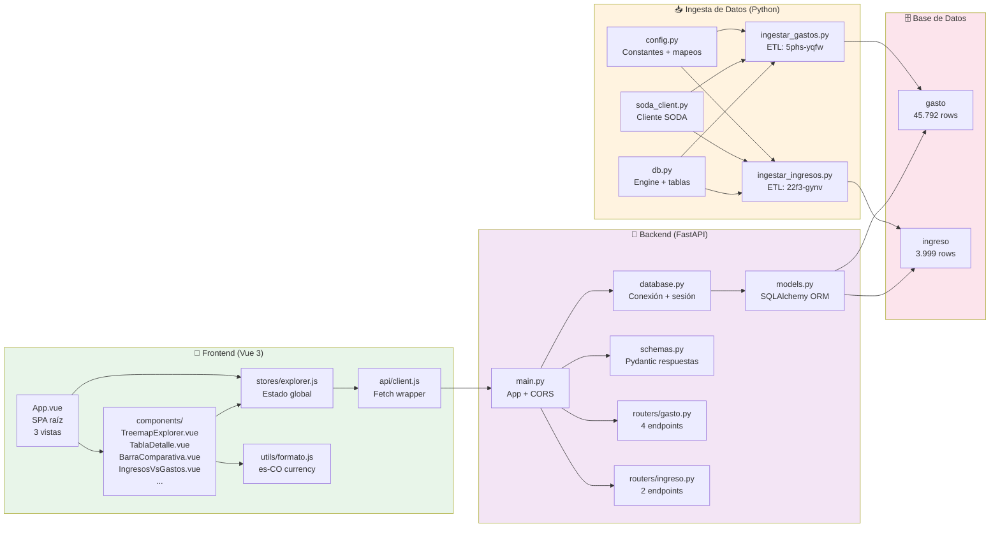
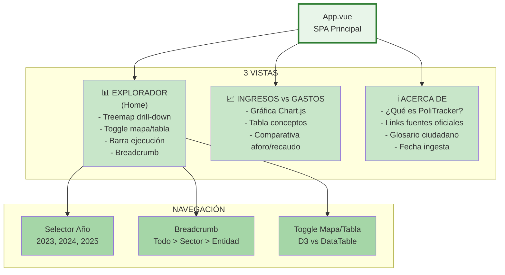
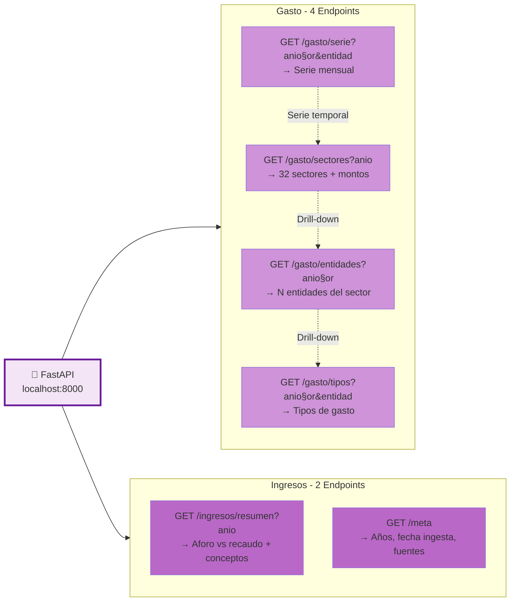
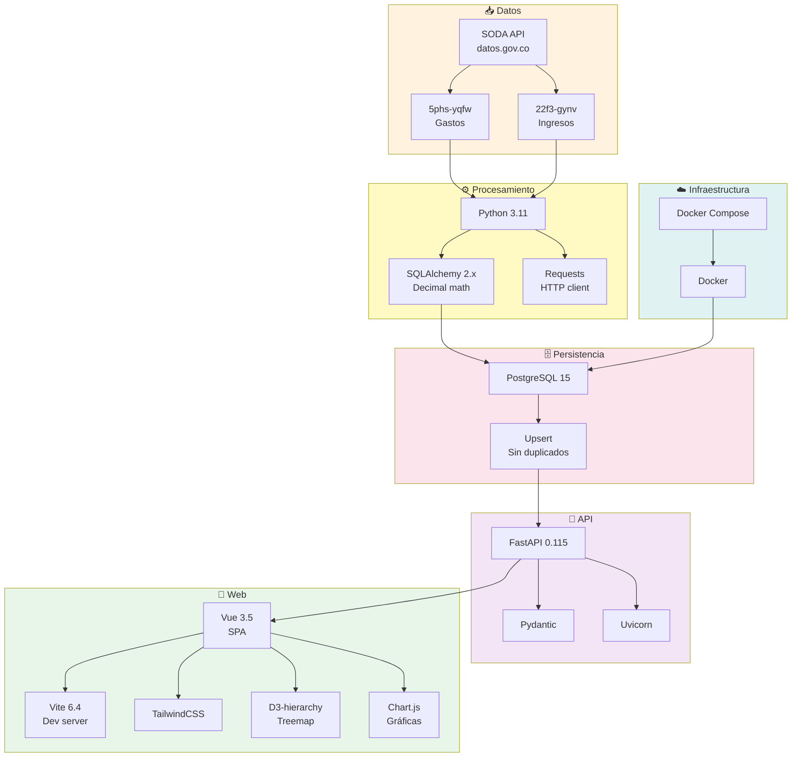

# PoliTracker - Arquitectura y Flujos

## 1. Arquitectura General del Sistema

---

## 2. Flujo de Datos - Drill-Down del Treemap

---

## 3. Estructura de Carpetas y Responsabilidades

---

## 4. Vistas del Frontend

---

## 5. Endpoints FastAPI

---

## 6. Propósito Final

```mermaid
graph LR
    A["📊 Datos Brutos<br/>246K registros SODA"]
    B["⚙️ Procesados<br/>Limpieza + Agregación<br/>45K registros útiles"]
    C["💾 Almacenados<br/>PostgreSQL<br/>Consultas rápidas"]
    D["🔌 Servidos<br/>FastAPI REST<br/>JSON con montos"]
    E["🎨 Visualizados<br/>Vue 3 + D3<br/>Treemap interactivo"]
    F["👤 Entendibles<br/>Ciudadano colombiano<br/>Sin login, sin jerga"]
    
    A -->|Ingesta| B
    B -->|Upsert| C
    C -->|Queries SQL| D
    D -->|APIs REST| E
    E -->|UI/UX clara| F
    
    style A fill:#fff3e0
    style B fill:#fff9c4
    style C fill:#fce4ec
    style D fill:#f3e5f5
    style E fill:#e8f5e9
    style F fill:#c8e6c9,stroke:#2e7d32,stroke-width:3px
```

---

## 7. Stack Tecnológico

---

## Resumen de Flujo Completo

1. **Minhacienda publica datos en SODA API** → 246K registros de gastos + 10K de ingresos
2. **Script Python descarga y limpia** → Agrega por llave única (sin duplicados)
3. **Upsert a PostgreSQL** → 45K filas de gasto + 4K de ingreso (Oct 2026)
4. **Backend FastAPI query** → 6 endpoints REST que responden en JSON
5. **Frontend Vue hace fetch** → Treemap D3 con drill-down de 3 niveles
6. **Ciudadano colombiano entiende** → Gráficas claras, sin login, datos públicos

---

**Propósito:** Que cualquier ciudadano, sin conocimientos técnicos, entienda en qué se gasta su dinero de impuestos.
