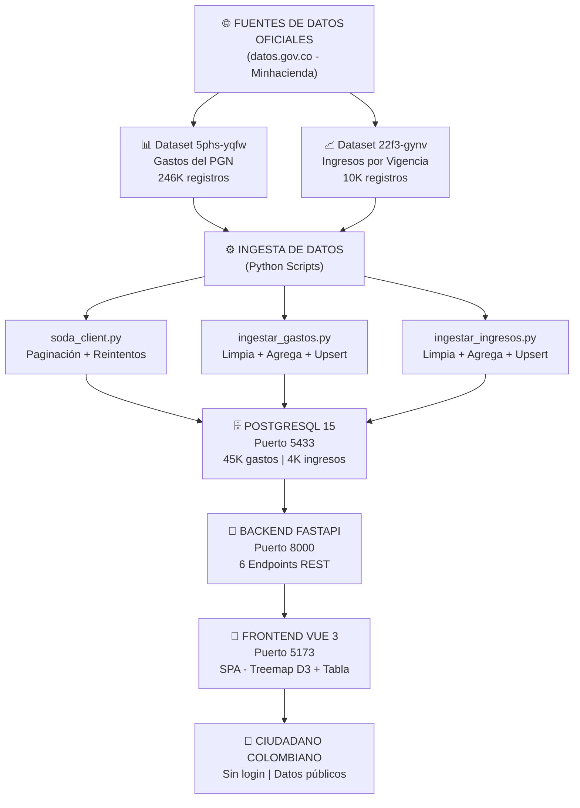
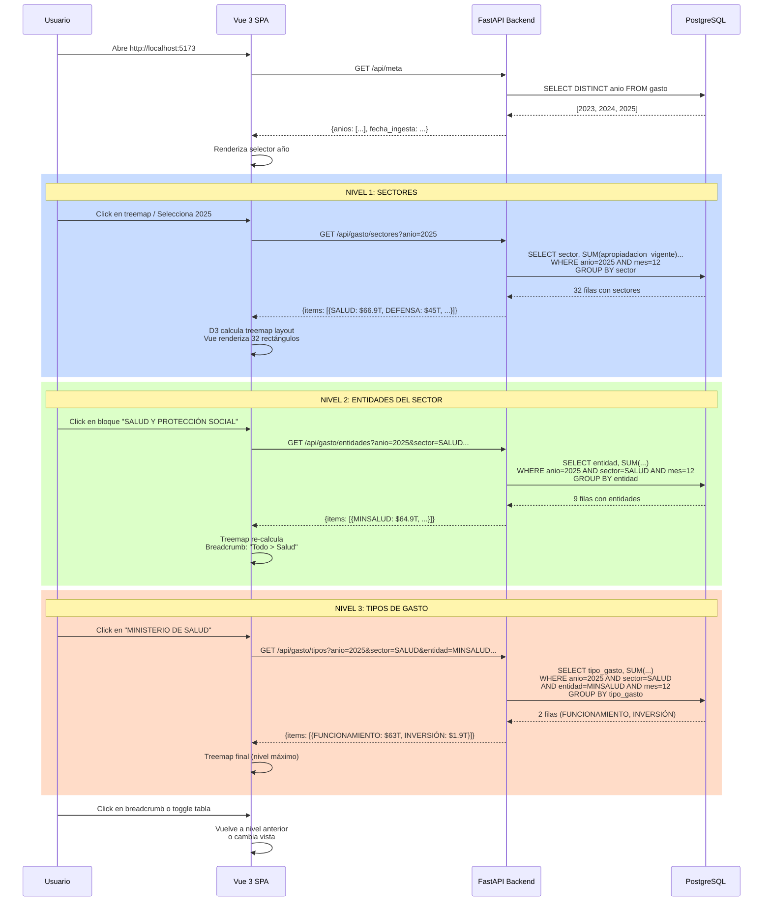
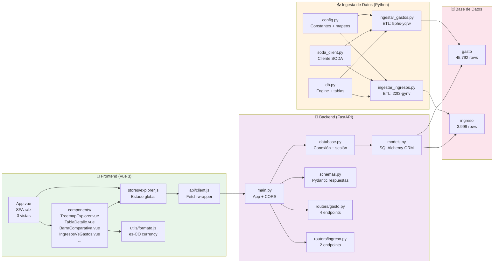
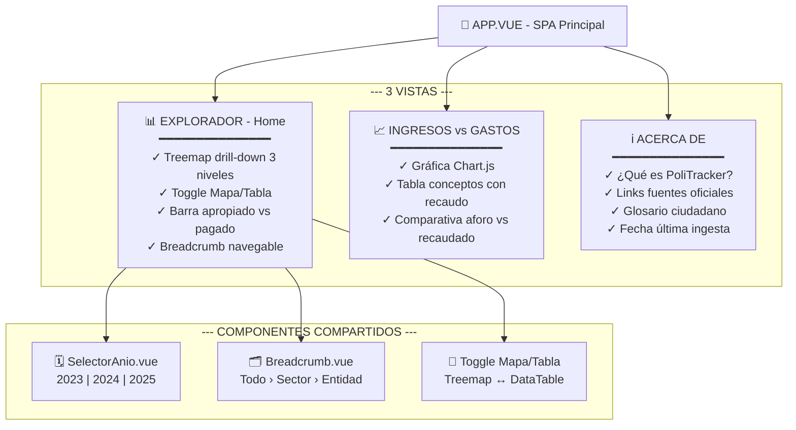
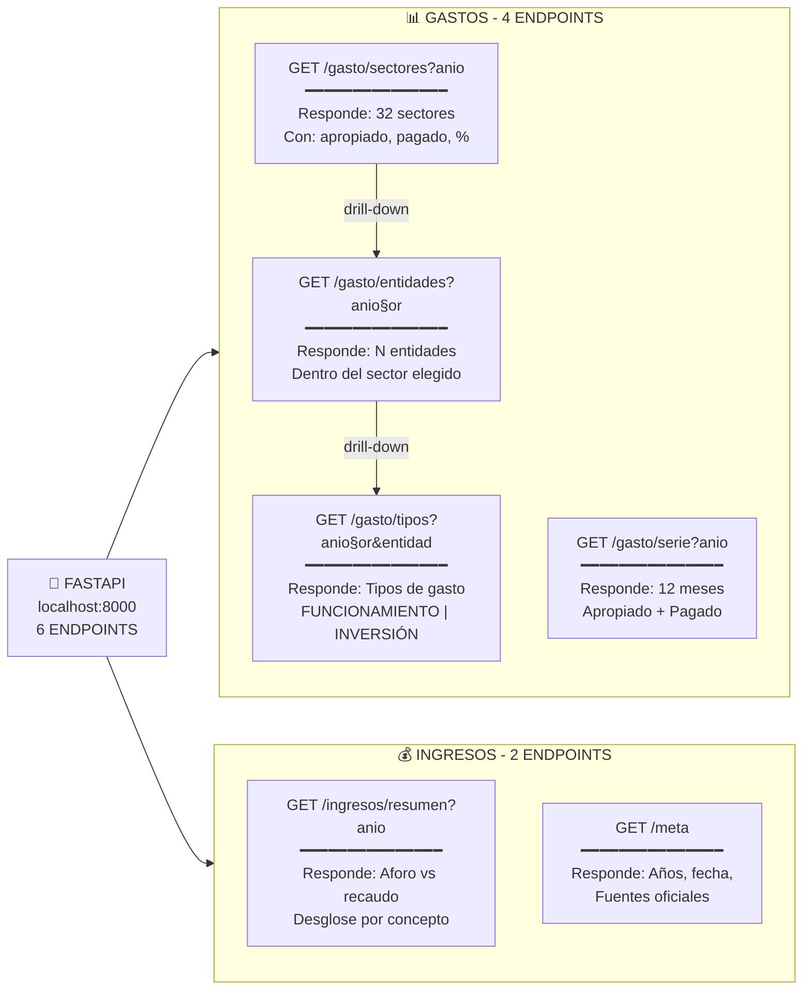
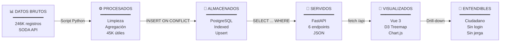

# PoliTracker - Arquitectura y Flujos

## 1. Arquitectura General del Sistema



---

## 2. Flujo de Datos - Drill-Down del Treemap



---

## 3. Estructura de Carpetas y Responsabilidades



---

## 4. Vistas del Frontend



---

## 5. Endpoints FastAPI



---

## 6. Propósito Final - Pipeline Completo



---

## 7. Stack Tecnológico Completo

| Capa | Tecnología | Detalles |
|------|-----------|----------|
| **📥 Datos** | SODA API (datos.gov.co) | 246K registros: 5phs-yqfw (gastos) + 22f3-gynv (ingresos) |
| **⚙️ Ingesta** | Python 3.11 + SQLAlchemy 2.x | Paginación + Upsert + Decimal math (sin float) |
| **🗄️ BD** | PostgreSQL 15 (Puerto 5433) | 45K gastos + 4K ingresos, Indexed, Unique constraints |
| **🔌 Backend** | FastAPI 0.115 + Uvicorn | 6 endpoints REST, Pydantic, CORS habilitado |
| **🎨 Frontend** | Vue 3.5 + Vite 6.4 | SPA, TailwindCSS, D3-hierarchy, Chart.js |
| **☁️ Infra** | Docker + Docker Compose | Orquestación local, volúmenes persistentes |

### Dependencias principales
```
Backend:
  - fastapi==0.115.6
  - sqlalchemy==2.0.36
  - psycopg2-binary==2.9.10
  - uvicorn[standard]==0.34.0

Ingesta:
  - requests==2.32.3
  - python-dotenv==1.0.1

Frontend:
  - vue@3.5.38
  - vite@6.4.3
  - tailwindcss@3.4.19
  - d3-hierarchy@3.1.2
  - chart.js@4.5.1
```

---

## Resumen de Flujo Completo

1. **Minhacienda publica datos en SODA API** → 246K registros de gastos + 10K de ingresos
2. **Script Python descarga y limpia** → Agrega por llave única (sin duplicados)
3. **Upsert a PostgreSQL** → 45K filas de gasto + 4K de ingreso (Oct 2026)
4. **Backend FastAPI query** → 6 endpoints REST que responden en JSON
5. **Frontend Vue hace fetch** → Treemap D3 con drill-down de 3 niveles
6. **Ciudadano colombiano entiende** → Gráficas claras, sin login, datos públicos

---

**Propósito:** Que cualquier ciudadano, sin conocimientos técnicos, entienda en qué se gasta su dinero de impuestos.
